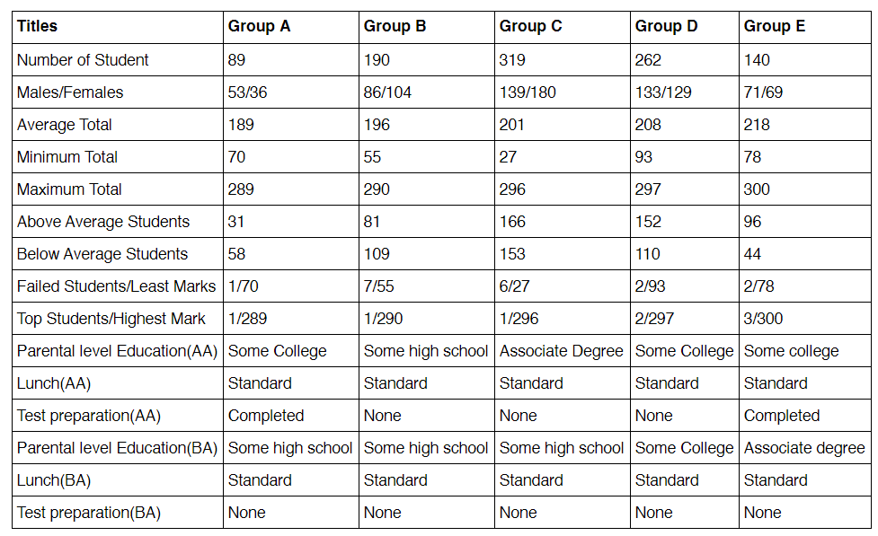

# Exploratory Data Analysis on Student Performances
This is a simple project with extensive exploratory data analysis on Student performances.

## Table of Content
* [General Info](#general-info)
* [Aim](#aim)
* [Technologies](#technology)
* [Data](#data)
* [Summary](#summary)
* [Conclusion](#conclusion)

## General info
The project is an in-depth analysis of the student's performances based on various factors that include Gender, Ethnicity, Parental level of education, Lunch and Test preparation course.

## Aim
To investigate the factors which contribute to the stident's performance.

## Technology
* Python
* Jupyter Notebook

## Data
The data was provided by Verzeo.

## Summary 

## Conclusion
From the above tables we can understand that induvidual results have resulted in better analysis than using the entire data at once. I had decided using race/ethinicity to be basis of the table using which helped me in recieving the deatiled analysis of the data given. The induvidual data grouping led to better understand the data by obtained varied results and reasoning behind it. On observing the above data we can conclude that, students of parent having good education atleast some college degree and standard food has led to better results in most of the groups. Test Preparation are helful in few groups but most of the students do well even without the course too. But if a student is interested in getting high marks he must attend the test preparation course. Group E seems to have the best results produced. Group A seems to produce the least results. Highest score is obtained by students in Group E with 300 and the lowest is obtained by Group C with 26 as total. Group E has the highest number of above average students followed by Group D and Group A with least number.
